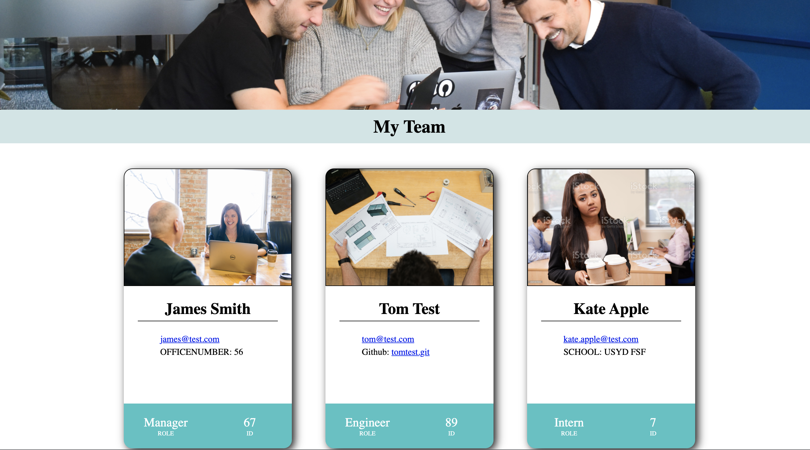

<div id="top"></div>
<div align="center">

[![Issues][issues-shield]][issues-url]
[![MIT License][license-shield]][license-url]
[![linkedin][linkedin-shield]][linkedin-url]

</div>
 <br />
 <br />

<div align="center">

</div>

<h3 align="center">Team Profile Generator</h3>

  <p align="center">
    A simple CLI app that dynamically creates a fully styled html element with team members from an orgnisation. This output can be viewed in the browser. The class structure is tested using Jest
    <br />
    <a href="https://github.com/TomSouthwick/Team-Profile-Generator"><strong>Explore the docs »</strong></a>
    <br />
    <br />
    ·
    <a href="https://github.com/TomSouthwick/Team-Profile-Generator/issues">Report Bug</a>
    ·
    <a href="https://github.com/TomSouthwick/Team-Profile-Generator/issues">Request Feature</a>
  </p>
</div>
<div align="center">

</div>
 <br />
 <br />
<!-- TABLE OF CONTENTS -->
<h3/>
<b/>
<details>
  <summary>Table of Contents</summary>
  <ol>
    <li>
      <a href="#about-the-project">About The Project</a>
      <ul>
        <li><a href="#built-with">Built With</a></li>
      </ul>
    </li>
    <li>
      <a href="#getting-started">Getting Started</a>
      <ul>
        <li><a href="#prerequisites">Prerequisites</a></li>
        <li><a href="#installation">Installation</a></li>
      </ul>
    </li>
    <li><a href="#usage">Usage</a></li>
    <li><a href="#roadmap">Roadmap</a></li>
    <li><a href="#license">License</a></li>
    <li><a href="#contact">Contact</a></li>
    <li><a href="#acknowledgments">Acknowledgments</a></li>
  </ol>
</details>
</h3>
</b>
 <br />
 <br />

<!-- ABOUT THE PROJECT -->

## About The Project

 <br />


 <br />

This project is designed to be able to track employees throughout an organisation. It is designed that a manager can print out their employee list onto a html document that is styled efficiently with CSS. Each type of employee, be it Intern, Engineer or manager has a different image and attribute associated with it. This is a really easy way to differentiate which employees are who, and their role within a firm.

<p align="right">(<a href="#top">back to top</a>)</p>

### Built With

- [Node.js](https://nodejs.org/en/)
- [npm inquirer](https://www.npmjs.com/package/inquirer)
- [Javascript](https://www.javascript.com/)
- [Jest.js](https://jestjs.io/)

<p align="right">(<a href="#top">back to top</a>)</p>

<!-- GETTING STARTED -->

## Getting Started

Clone the repo into a local folder. Open that folder in VS Code.

### Prerequisites

Ensure that VS Code has the required languages inc. JS, HTML and CSS with the respective functionalities built in.

### Installation

1. Clone the repo
   ```sh
   git clone https://github.com/TomSouthwick/Team-Profile-Generator.git
   ```
2. Install NPM packages
   ```sh
   npm install
   ```
3. Run inquirer
   ```sh
   node index.js
   ```
4. Run jest
   ```sh
   npm run test
   ```

<p align="right">(<a href="#top">back to top</a>)</p>

<!-- USAGE EXAMPLES -->

## Usage

A user will be promoted to add in their manager and any other respective colleagues that they work with. Once they've completed all entries, the user can open the output folder, and `team.html` in the browser to see their team displayed own their own unique cards. Make sure you run a test after generating your content to ensure that all the clases respective fields have been put in and have called accordingly.

_For more examples, please refer to the [Documentation](https://github.com/TomSouthwick/Team-Profile-Generator)_

<p align="right">(<a href="#top">back to top</a>)</p>

<!-- ROADMAP -->

## Roadmap

- [] Creating a functioning inquirer prompt.
- [] Creating and extending classes as a property.
- [] Linking answers into a dynamic html element.
  - [] html generator is vanilla and does not use any frameworks.
- [] Creating and writing testing methods.
  - [] Passing all the testing methods.

See the [open issues](https://github.com/TomSouthwick/Team-Profile-Generator/issues) for a full list of proposed features (and known issues).

<p align="right">(<a href="#top">back to top</a>)</p>

<!-- CONTRIBUTING -->

<!-- LICENSE -->

## License

Distributed under the MIT License. See `LICENSE.txt` for more information.

<p align="right">(<a href="#top">back to top</a>)</p>

<!-- CONTACT -->

## Contact

Tom Southwick - [Linkedin](https://linkedin.com/in/tomsouthwick)

Project Link: [https://github.com/TomSouthwick/Team-Profile-Generator](https://github.com/TomSouthwick/Team-Profile-Generator)

<p align="right">(<a href="#top">back to top</a>)</p>

<!-- ACKNOWLEDGMENTS -->

## Acknowledgments

- [ReadMe](https://github.com/othneildrew/Best-README-Template.git)

<p align="right">(<a href="#top">back to top</a>)</p>

<!-- MARKDOWN LINKS & IMAGES -->
<!-- https://www.markdownguide.org/basic-syntax/#reference-style-links -->

[issues-shield]: https://img.shields.io/github/issues/TomSouthwick/Team-Profile-Generator.svg?style=for-the-badge
[issues-url]: https://github.com/TomSouthwick/Team-Profile-Generator/issues
[license-shield]: https://img.shields.io/github/license/TomSouthwick/Team-Profile-Generator.svg?style=for-the-badge
[license-url]: https://github.com/TomSouthwick/Team-Profile-Generator/blob/master/LICENSE.txt
[linkedin-shield]: https://img.shields.io/badge/-LinkedIn-black.svg?style=for-the-badge&logo=linkedin&colorB=555
[linkedin-url]: https://linkedin.com/in/tomsouthwick
[product-screenshot]: images/screenshot.png
